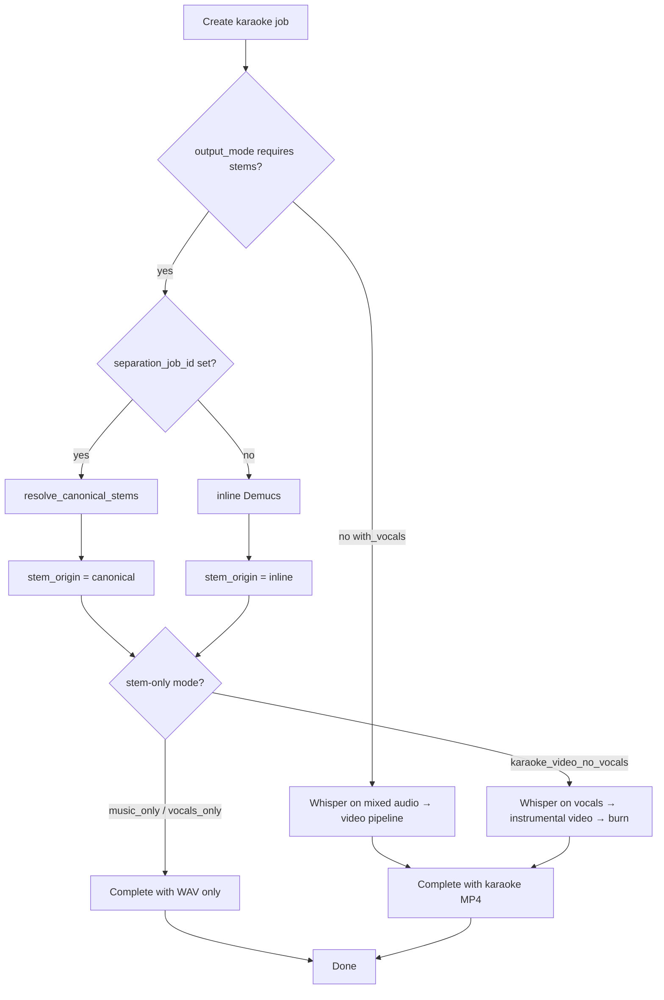

# Phase 5 — Milestone 4: Stem Reuse and Additional Output Modes

**Status:** Complete (committed @ `ddb2366`; tagged `phase5-complete`, `phase5-final`)

**Branch:** `feature/source-separation` (pushed)

---

## Summary

Milestone 4 completes Phase 5 by adding stem-only karaoke output modes and optional reuse of canonical stems from a completed `vocal_separation` job. When `separation_job_id` is supplied, Demucs is skipped entirely and existing `vocals.wav` / `instrumental.wav` paths are used.

---

## Architecture

### Decision flow (karaoke jobs)



### Stem ownership

| Scenario | `stem_origin` | Demucs |
|----------|---------------|--------|
| `vocal_separation` job | `canonical` | Yes (canonical owner) |
| Karaoke with inline separation | `inline` | Yes |
| Karaoke with `separation_job_id` | `canonical` | **No** (reuse paths) |
| `karaoke_video_with_vocals` | *(none)* | No |

### New module: `stem_reuse.py`

`resolve_canonical_stems(db, separation_job_id)` validates:

1. Job exists
2. `job_type == vocal_separation` (via `require_canonical_stem_job`)
3. `status == completed`
4. `stem_origin == canonical`
5. `result_files.vocals` and `result_files.instrumental` exist on disk

Returns `ResolvedCanonicalStems` with absolute paths and optional `separation_model`.

### Karaoke mode helpers (`karaoke_modes.py`)

| Helper | Modes |
|--------|-------|
| `mode_requires_stems()` | `karaoke_video_no_vocals`, `vocals_only`, `music_only` |
| `mode_is_stem_only()` | `vocals_only`, `music_only` |
| `mode_requires_video_pipeline()` | `karaoke_video_with_vocals`, `karaoke_video_no_vocals` |

### API validation (`schemas/job.py`)

- `separation_job_id` allowed only on `job_type: karaoke`
- Allowed output modes with `separation_job_id`: `karaoke_video_no_vocals`, `vocals_only`, `music_only`
- Rejected for `karaoke_video_with_vocals` (no stems needed)

### Download endpoints

No route changes. `_stem_download_allowed()` now permits stem downloads when `stem_origin` is `inline` **or** `canonical` and `result_files` contains stem paths — covering reused-stem karaoke jobs.

---

## Implemented output modes (all four)

| `output_mode` | Video | Whisper | Demucs | Notes |
|---------------|-------|---------|--------|-------|
| `karaoke_video_with_vocals` | Yes | Yes (mixed) | No | Default; unchanged |
| `karaoke_video_no_vocals` | Yes | Yes (vocals) | Inline or reuse | Unchanged API |
| `music_only` | No | No | Inline or reuse | Returns `instrumental.wav` |
| `vocals_only` | No | No | Inline or reuse | Returns `vocals.wav` |

---

## API examples

### Stem-only with reuse

```json
POST /api/v1/jobs
{
  "media_id": "<uuid>",
  "job_type": "karaoke",
  "parameters": {
    "output_mode": "music_only",
    "separation_job_id": "<completed-vocal_separation-job-id>"
  }
}
```

```json
POST /api/v1/jobs
{
  "media_id": "<uuid>",
  "job_type": "karaoke",
  "parameters": {
    "output_mode": "vocals_only",
    "separation_job_id": "<completed-vocal_separation-job-id>"
  }
}
```

### Video mode with reuse (no second Demucs run)

```json
POST /api/v1/jobs
{
  "media_id": "<uuid>",
  "job_type": "karaoke",
  "parameters": {
    "output_mode": "karaoke_video_no_vocals",
    "separation_job_id": "<completed-vocal_separation-job-id>"
  }
}
```

### Completed metadata — `music_only` (reuse)

```json
{
  "output_mode": "music_only",
  "stem_origin": "canonical",
  "separation_job_id": "2ed4465c-d766-4f97-8375-ba322add75cc",
  "result_files": {
    "instrumental": "processed/2ed4465c-d766-4f97-8375-ba322add75cc_instrumental.wav"
  }
}
```

Note: reused paths point at the **canonical separation job** files (not copied).

---

## Files changed

| File | Change |
|------|--------|
| `backend/app/services/stem_reuse.py` | **New** — canonical stem resolution |
| `backend/app/services/karaoke_modes.py` | All 4 modes; stem/video helper functions |
| `backend/app/schemas/job.py` | `separation_job_id` validation |
| `backend/app/api/v1/endpoints/jobs.py` | Stem download for canonical reuse; OpenAPI text |
| `backend/app/tasks/media_tasks.py` | `karaoke_task` reuse path, stem-only early exit, `_karaoke_run_inline_demucs()` |

**Unchanged:** Celery routing, download URL paths, Redis progress keys, `async_runner` pattern.

---

## Validation evidence

Reference separation job: `2ed4465c-d766-4f97-8375-ba322add75cc` (completed `vocal_separation`, `stem_origin: canonical`).

Validation used `unittest.mock.patch` on `SourceSeparationService.separate` with `AssertionError` side effect to prove Demucs was not invoked when `separation_job_id` was set.

| Test | Job ID | Result |
|------|--------|--------|
| **A** — vocal_separation stems | `2ed4465c-d766-4f97-8375-ba322add75cc` | **PASS** — `vocals.wav` + `instrumental.wav` on disk |
| **B** — `music_only` + reuse | `ccfbda12-988f-40cc-aed2-01769e414389` | **PASS** — `status=completed`, `stem_origin=canonical`, Demucs mock `await_count=0`, `result_path` = canonical instrumental |
| **C** — `vocals_only` + reuse | `180303ee-cd9f-40f3-845a-60e8da335817` | **PASS** — `status=completed`, canonical vocals reused |
| **D** — `karaoke_video_no_vocals` + reuse | `1f9e107e-2585-435b-afa2-a46dd64fb6e0` | **PASS** — log `karaoke_stems_reused`, Demucs not called, `karaoke.mp4` generated, `stem_origin=canonical` |

Test D log excerpt:

```
karaoke_stems_reused separation_job_id=2ed4465c-...
  vocals=processed/2ed4465c-..._vocals.wav
  instrumental=processed/2ed4465c-..._instrumental.wav
karaoke_task_done output_mode=karaoke_video_no_vocals stem_origin=canonical
```

---

## Regression assessment

| Area | Risk | Assessment |
|------|------|------------|
| `karaoke_video_with_vocals` | Low | No code path changes; `separation_job_id` rejected at schema validation |
| `karaoke_video_no_vocals` (inline) | Low | Inline Demucs path unchanged when `separation_job_id` absent |
| Download endpoints | Low | Same URLs; `_stem_download_allowed` extended, not replaced |
| `vocal_separation` | None | Untouched |
| Celery / Redis | None | Same `run_async()` + progress updates |
| Schema defaults | None | Default `output_mode` remains `karaoke_video_with_vocals` |

**Breaking changes:** None.

---

## Related docs

- `PHASE5_MILESTONE3_KARAOKE_MODES.md` — video modes (M3)
- `PHASE5_MILESTONE2_VOCAL_SEPARATION.md` — canonical stem owner
- `PHASE5_STEM_OWNERSHIP_AND_OPS.md` — ownership model
