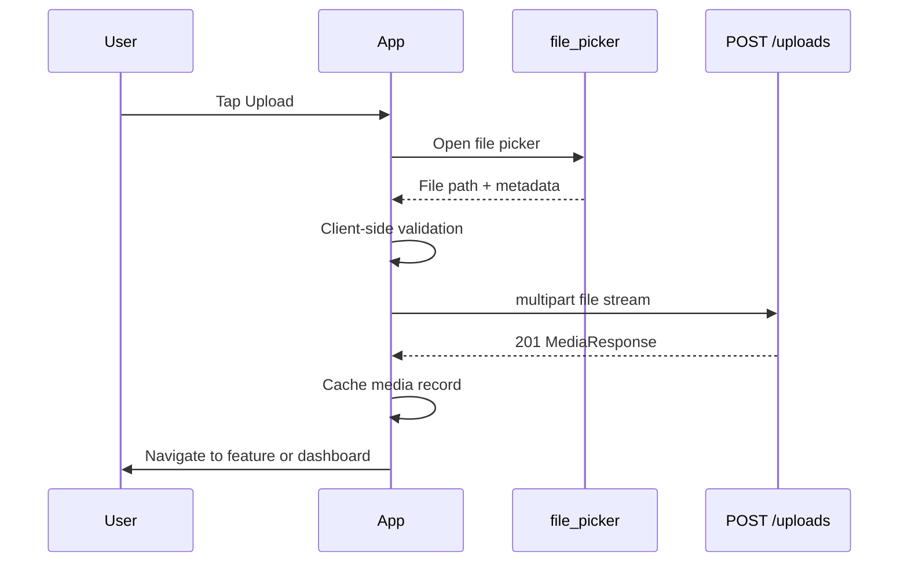
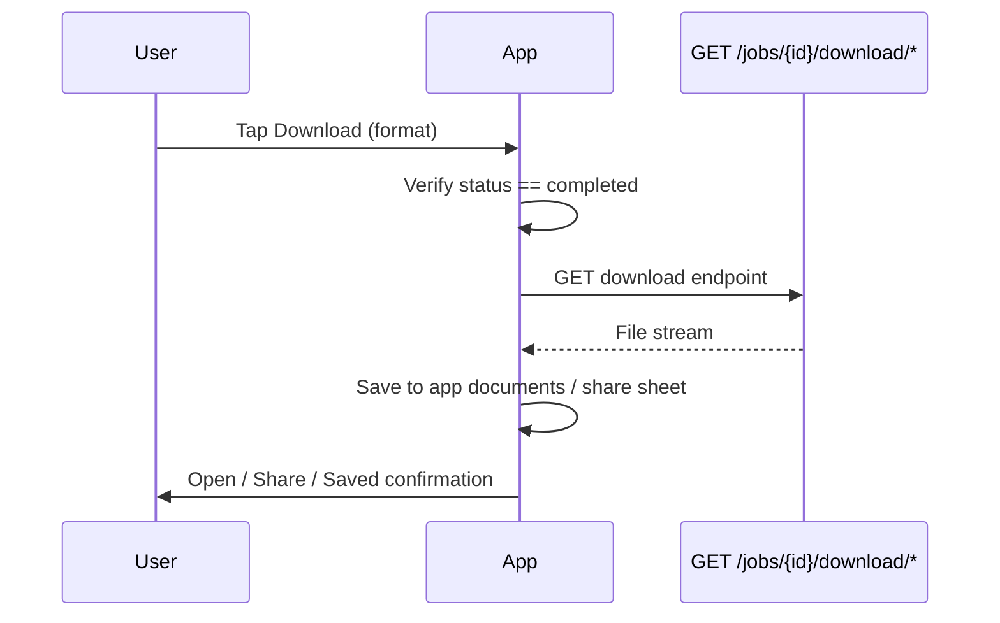

# Phase 9 — Flutter Frontend MVP Design

**Date:** 2026-06-24  
**Branch:** `feature/flutter-frontend-mvp`  
**Authoritative context:** `docs/context/PROJECT_SNAPSHOT_2026_06_22.md`  
**Scope:** Documentation and design only — **no Flutter code, no backend changes, no package installation**

---

## Executive Summary

Phase 9 delivers a **mobile-first Flutter client** for the existing VoxClone REST API (Phases 1–7). The app exposes five commercial MVP pipelines — subtitles, karaoke, audio enhancement, vocal separation, and music separation — without authentication, billing, or voice cloning. English is the primary product language; Urdu is available behind an explicit **"Urdu (Experimental)"** label.

The backend remains unchanged: FastAPI · Redis · Celery · SQLite · whisper.cpp · DeepFilterNet · Demucs. The Flutter app is a thin, resilient client that uploads media, creates jobs, polls progress, and downloads results while surfacing the global output retention policy before every job submission.

---

## 1. Product Goals

| Goal | Description |
|------|-------------|
| **Commercial MVP shell** | Ship a usable mobile app that validates demand before Phase 10–12 hardening |
| **Five core pipelines** | Subtitles, karaoke, enhance audio, separate vocals, separate music |
| **English-first UX** | Default language English; M3-recommended models (`base` for subtitles/karaoke) |
| **Experimental Urdu** | Optional language selection with clear experimental labeling — not marketed as production-grade |
| **Async batch UX** | Set expectations for long-running CPU jobs (M3: RTF > 1.0 on Hetzner) |
| **Retention transparency** | Warn users before processing that outputs expire after **N days** (default 10, configurable) |
| **Zero backend rewrite** | Consume existing REST endpoints; no new microservices or auth layer in Phase 9 |
| **Future-ready seams** | Architecture accommodates Phase 10 auth headers, Phase 11 entitlements, and retention API fields without refactor |

### Explicit non-goals (Phase 9)

- Voice cloning / voice replacement UI (HTTP 422 on backend)
- Roman Urdu transliteration (Phase 13)
- Subtitle burn-in workflow (API exists; deferred from MVP UI to reduce scope)
- User accounts, billing, or subscription gating
- Hetzner deployment configuration (Phase 12)
- WebSocket progress (HTTP polling only)

---

## 2. User Personas

### Persona A — YouTube Creator ("Sam")

| Attribute | Detail |
|-----------|--------|
| Goal | Generate English subtitles and karaoke videos for music covers |
| Technical level | Low — expects tap-and-wait UX |
| Device | Android phone (primary), occasional tablet |
| Pain points | Long wait times; needs clear progress and download notifications |
| MVP features | Generate Subtitles, Generate Karaoke |

### Persona B — Course Creator ("Aisha")

| Attribute | Detail |
|-----------|--------|
| Goal | Clean lecture audio and produce SRT files for LMS upload |
| Technical level | Medium — understands SRT vs VTT |
| Device | iPhone |
| Pain points | Background noise in recordings; needs enhanced WAV + subtitle files |
| MVP features | Enhance Audio, Generate Subtitles |

### Persona C — Remix Producer ("Dev")

| Attribute | Detail |
|-----------|--------|
| Goal | Extract vocal and instrumental stems for remix workflows |
| Technical level | High — understands WAV stems and reuse |
| Device | Android tablet |
| Pain points | Large file uploads; wants stem download and job history |
| MVP features | Separate Vocals, Separate Music, Generate Karaoke (no-vocals mode) |

### Persona D — Urdu Content Tester ("Hassan")

| Attribute | Detail |
|-----------|--------|
| Goal | Test Urdu subtitle quality on tutorial content |
| Technical level | Medium |
| Device | Android phone |
| Pain points | Must understand quality is experimental; long processing times |
| MVP features | Generate Subtitles with `language: ur`, `whisper_model: small` |

---

## 3. Mobile-First Design Principles

1. **Thumb-zone navigation** — Primary actions (Upload, New Job) in bottom navigation or FAB; secondary actions in app bar overflow.
2. **Single-column layouts** — All screens stack vertically; no desktop-only multi-pane assumptions.
3. **Progressive disclosure** — Advanced options (Whisper model tier, karaoke output mode, separation reuse) behind "Advanced" expanders.
4. **Offline-aware, not offline-first** — App requires network for all API operations; cache job/media lists locally for read-only viewing when disconnected.
5. **Large touch targets** — Minimum 48×48 dp for buttons; generous padding on list tiles.
6. **Readable on small screens** — Truncate long filenames with ellipsis; show duration and file size as secondary text.
7. **Async patience UX** — Progress bars, step labels (`current_step` from API), estimated-time hints for known job types.
8. **Safe areas & platform adaptation** — Respect iOS notch/Android gesture nav; use Material 3 with Cupertino overrides where appropriate.
9. **Accessibility** — Semantic labels on icons; sufficient contrast; support system font scaling.
10. **English product copy** — All UI strings in English; Urdu appears only as a labeled language option, not as UI localization.

---

## 4. Navigation Architecture

### 4.1 Navigation model

Use **declarative routing** (`go_router`) with a **shell route** for the main tab scaffold and **full-screen routes** for job flows.

```
                    ┌─────────────┐
                    │   Splash    │
                    └──────┬──────┘
                           │ health OK
                           ▼
              ┌────────────────────────┐
              │     Main Shell         │
              │  (Bottom Navigation)   │
              ├────────┬───────┬───────┤
              │ Dash   │ Jobs  │ More  │
              └────┬───┴───┬───┴───┬───┘
                   │       │       │
         ┌─────────┘       │       └──────────┐
         ▼                 ▼                  ▼
    Upload Media      Job Status         Settings
         │            (detail)              About
         ▼                 │
    Feature screens        │
    (Subtitles,            │
     Karaoke, etc.)        ▼
                      Downloads
```

### 4.2 Bottom navigation tabs

| Tab | Icon | Root screen | Purpose |
|-----|------|-------------|---------|
| **Home** | `home` | Dashboard | Feature cards, recent jobs, quick upload |
| **Jobs** | `work` | Job list (aggregated locally) | All jobs across media |
| **More** | `menu` | Settings hub | Settings, About, API config |

### 4.3 Route table

| Route | Screen | Entry points |
|-------|--------|--------------|
| `/` | Splash | App launch |
| `/home` | Dashboard | Tab 1 |
| `/upload` | Upload Media | FAB, Dashboard "Upload" |
| `/features/subtitles` | Generate Subtitles | Dashboard card |
| `/features/karaoke` | Generate Karaoke | Dashboard card |
| `/features/enhance` | Enhance Audio | Dashboard card |
| `/features/separate-vocals` | Separate Vocals | Dashboard card |
| `/features/separate-music` | Separate Music | Dashboard card |
| `/jobs/:id` | Job Status | Job list, post-submit redirect |
| `/downloads` | Downloads | Job Status, Jobs tab filter |
| `/settings` | Settings | More tab |
| `/about` | About | Settings link |

### 4.4 Deep linking (future)

Reserve route parameters for Phase 10 share links (`/jobs/:id?token=…`). No implementation in Phase 9.

---

## 5. Application Architecture

### 5.1 Recommended pattern: **Feature-First Clean Architecture**

Layer responsibilities:

```
┌─────────────────────────────────────────────────────────┐
│  Presentation (Flutter widgets, screens, controllers) │
├─────────────────────────────────────────────────────────┤
│  Application (Riverpod providers / notifiers)           │
├─────────────────────────────────────────────────────────┤
│  Domain (entities, repository interfaces, use cases)    │
├─────────────────────────────────────────────────────────┤
│  Data (API clients, DTOs, local cache, mappers)         │
└─────────────────────────────────────────────────────────┘
                              │
                              ▼
                    VoxClone REST API (FastAPI)
```

**Rationale:** Matches backend's service-oriented design; each MVP feature maps to a feature module with shared core (network, config, job polling).

### 5.2 Recommended folder structure

```
lib/
├── main.dart
├── app/
│   ├── app.dart                 # MaterialApp + router
│   ├── router.dart              # go_router definitions
│   └── theme.dart               # Material 3 theme
├── core/
│   ├── config/
│   │   ├── app_config.dart      # API base URL, retention days default
│   │   └── env.dart             # dev/staging/prod flavors
│   ├── network/
│   │   ├── dio_client.dart
│   │   ├── api_exception.dart
│   │   └── interceptors/        # logging, future auth
│   ├── storage/
│   │   └── local_cache.dart     # Hive/SharedPreferences job cache
│   ├── polling/
│   │   └── job_poller.dart      # Shared polling logic
│   └── widgets/                 # Shared UI components
├── features/
│   ├── splash/
│   ├── dashboard/
│   ├── upload/
│   ├── subtitles/
│   ├── karaoke/
│   ├── enhance/
│   ├── separation/              # vocals + music screens share logic
│   ├── jobs/                    # job status, list
│   ├── downloads/
│   ├── settings/
│   └── about/
└── shared/
    ├── models/                  # Media, Job, JobProgress DTOs
    └── repositories/
        ├── media_repository.dart
        ├── job_repository.dart
        └── health_repository.dart
```

### 5.3 Technology recommendations

| Concern | Recommendation | Alternatives considered |
|---------|----------------|------------------------|
| **Architecture** | Feature-first Clean Architecture + Repository | BLoC-only (heavier boilerplate for MVP) |
| **State management** | **Riverpod 2.x** (`AsyncNotifier`, `StreamProvider`) | BLoC (more ceremony), Provider (less compile-safe) |
| **Routing** | **go_router** | Navigator 2.0 manual, auto_route |
| **Networking** | **dio** | http (less interceptor support) |
| **JSON serialization** | **freezed** + **json_serializable** | manual parsing |
| **File upload** | **dio** `MultipartFile` + **file_picker** / **image_picker** | http multipart, cross_file only |
| **Local persistence** | **Hive** or **drift** (job/media cache) | SharedPreferences (too limited for job lists) |
| **Download to device** | **path_provider** + **permission_handler** + dio download | share_plus for export |
| **Config** | **flutter_dotenv** or compile-time `--dart-define` | hard-coded (avoid) |

### 5.4 Why Riverpod

- Compile-safe providers with minimal boilerplate for async API state
- Natural fit for polling (`Timer` + `ref.invalidate` or `StreamProvider`)
- Easy to inject auth token interceptor in Phase 10 without widget-tree refactors
- `AsyncValue` maps cleanly to loading/error/data UI states

---

## 6. State Management Recommendation

### 6.1 Provider topology

| Provider | Type | Responsibility |
|----------|------|----------------|
| `dioProvider` | Singleton | Configured Dio instance |
| `appConfigProvider` | Singleton | Base URL, retention days, feature flags |
| `healthProvider` | `FutureProvider` | Splash health check |
| `mediaListProvider` | `AsyncNotifier` | Paginated media from `GET /media` |
| `uploadNotifierProvider` | `AsyncNotifier` | Upload progress state machine |
| `jobPollerProvider` | `StreamProvider.family` | Poll `GET /jobs/{id}/progress` |
| `activeJobsProvider` | `AsyncNotifier` | Local aggregate of in-flight jobs |
| `retentionConfigProvider` | Singleton | Days until expiry (default 10; future API) |

### 6.2 Job lifecycle state machine

```
        ┌─────────┐
        │  idle   │
        └────┬────┘
             │ submit
             ▼
        ┌─────────┐     poll      ┌────────────┐
        │ queued  │──────────────►│ processing │
        └────┬────┘               └─────┬──────┘
             │                          │
             │         ┌────────────────┼────────────────┐
             │         ▼                ▼                ▼
             │   ┌──────────┐    ┌─────────┐    ┌───────────┐
             └──►│ completed│    │ failed  │    │ cancelled │
                 └──────────┘    └─────────┘    └───────────┘
```

Terminal states stop polling. Persist job records locally so the Jobs tab survives app restarts.

---

## 7. API Integration Strategy

### 7.1 Base configuration

| Setting | Development default | Production (Phase 12) |
|---------|--------------------|-----------------------|
| Base URL | `http://10.0.2.2:8000` (Android emulator) / `http://localhost:8000` | `https://api.voxclone.example` |
| API prefix | `/api/v1` | `/api/v1` |
| OpenAPI | `GET /openapi.json` | Use for codegen validation |
| Auth | None (Phase 9) | Bearer token (Phase 10) |
| Timeout | Connect 30s; receive 120s (uploads) | Same + CDN edge in Phase 12 |

User-configurable base URL in Settings for local dev and staging.

### 7.2 Complete endpoint map

| MVP feature | HTTP | Endpoint | Notes |
|-------------|------|----------|-------|
| Health check | `GET` | `/health` | Splash gate |
| Upload media | `POST` | `/api/v1/uploads` | `multipart/form-data`, field `file` |
| List media | `GET` | `/api/v1/media?page=&page_size=` | Dashboard recent uploads |
| Get media | `GET` | `/api/v1/media/{id}` | Detail refresh |
| Delete media | `DELETE` | `/api/v1/media/{id}` | Settings cleanup |
| Download original | `GET` | `/api/v1/media/{id}/download` | Optional |
| List media jobs | `GET` | `/api/v1/media/{id}/jobs` | Per-media history |
| **Generate Subtitles** | `POST` | `/api/v1/jobs` | `job_type: subtitle_generation` |
| **Generate Karaoke** | `POST` | `/api/v1/jobs` | `job_type: karaoke` |
| **Enhance Audio** | `POST` | `/api/v1/jobs` | `job_type: audio_enhance` |
| **Separate Vocals/Music** | `POST` | `/api/v1/jobs` | `job_type: vocal_separation` |
| Job details | `GET` | `/api/v1/jobs/{id}` | Full record + parameters |
| Job progress | `GET` | `/api/v1/jobs/{id}/progress` | Poll every 2–5 s |
| Cancel job | `DELETE` | `/api/v1/jobs/{id}` | Optional UX |
| Download subtitles | `GET` | `/api/v1/jobs/{id}/download/{transcript\|srt\|vtt}` | Subtitles + karaoke |
| Download karaoke video | `GET` | `/api/v1/jobs/{id}/download/karaoke-video` | Karaoke |
| Download karaoke ASS | `GET` | `/api/v1/jobs/{id}/download/ass` | Advanced export |
| Download vocals | `GET` | `/api/v1/jobs/{id}/download/vocals` | Separation |
| Download instrumental | `GET` | `/api/v1/jobs/{id}/download/instrumental` | Separation / music |
| Download enhanced | `GET` | `/api/v1/jobs/{id}/download/enhanced` | Enhancement |
| Generic result | `GET` | `/api/v1/jobs/{id}/result` | Fallback download |

### 7.3 Error response contract

All domain errors return:

```json
{
  "error": "error_code",
  "message": "Human-readable message",
  "detail": "Additional detail"
}
```

Map `error_code` to user-facing strings in the Flutter layer (see §12).

### 7.4 OpenAPI as source of truth

Generate or manually maintain DTOs aligned with:

- `MediaResponse`, `JobResponse`, `JobProgressResponse`, `JobCreate`
- Pydantic validation rules in `backend/app/schemas/job.py`

---

## 8. Upload Workflow

### 8.1 Sequence



### 8.2 Client validation (mirror backend)

| Rule | Backend source | Client action |
|------|----------------|---------------|
| Allowed extensions | `mp4, webm, mov, mkv, avi, mp3, wav, flac, m4a` | Reject before upload |
| Max size | 2 GB (`MAX_UPLOAD_SIZE_BYTES`) | Show error if exceeded |
| Non-empty file | Implicit | Reject 0-byte files |
| Filename present | Extension required | Prompt rename if missing ext |

### 8.3 Upload UX states

| State | UI |
|-------|-----|
| Selecting | Platform picker (video/audio MIME filters) |
| Uploading | Linear progress (bytes sent if available; indeterminate fallback) |
| Success | Snackbar + navigate to selected feature with `media_id` pre-filled |
| Failure | Retry button; preserve selected file path |

### 8.4 Implementation notes

- Stream file via Dio `MultipartFile.fromFile` — do not load entire 2 GB into memory
- Show upload progress using Dio `onSendProgress`
- On success, store `media_id` in navigation extra for downstream job screens

---

## 9. Job Creation Workflow

### 9.1 Shared pre-submit checklist

Every feature screen must:

1. Confirm a **media file is selected** (existing upload or pick-new flow)
2. Display **retention notice** (see §13) — user must acknowledge
3. Show **parameter summary** (language, model tier, output mode)
4. Submit `POST /api/v1/jobs`
5. On `201`, navigate to **Job Status** with new `job_id`
6. Start polling immediately

### 9.2 Job payloads by feature

#### Generate Subtitles

```json
{
  "media_id": "<uuid>",
  "job_type": "subtitle_generation",
  "parameters": {
    "language": "en",
    "whisper_model": "base"
  }
}
```

| Parameter | MVP default | Options |
|-----------|-------------|---------|
| `language` | omitted (English routing) or `"en"` | BCP-47 codes; `"ur"` labeled experimental |
| `whisper_model` | `"base"` (M3 recommendation; backend default is `tiny`) | `tiny`, `base`, `small` |

#### Generate Karaoke

```json
{
  "media_id": "<uuid>",
  "job_type": "karaoke",
  "parameters": {
    "language": "en",
    "whisper_model": "base",
    "output_mode": "karaoke_video_with_vocals"
  }
}
```

| `output_mode` | Description |
|---------------|-------------|
| `karaoke_video_with_vocals` | Default — karaoke MP4 with original audio |
| `karaoke_video_no_vocals` | Karaoke over instrumental (inline Demucs) |
| `vocals_only` | Vocals stem only |
| `music_only` | Instrumental stem only |

Advanced: optional `separation_job_id` to reuse stems from a completed `vocal_separation` job.

#### Enhance Audio

```json
{
  "media_id": "<uuid>",
  "job_type": "audio_enhance",
  "parameters": null
}
```

#### Separate Vocals / Separate Music

Both use the same job creation; downloads differ post-completion.

```json
{
  "media_id": "<uuid>",
  "job_type": "vocal_separation",
  "parameters": {
    "separation_model": "htdemucs"
  }
}
```

| Feature screen | Primary download endpoint |
|----------------|---------------------------|
| Separate Vocals | `GET /jobs/{id}/download/vocals` |
| Separate Music | `GET /jobs/{id}/download/instrumental` |

### 9.3 Post-create behavior

- Persist `{ job_id, media_id, job_type, created_at }` to local cache
- Register job with global poller
- Show non-blocking snackbar: "Job started — processing may take several minutes"

---

## 10. Progress Polling Workflow

### 10.1 Polling strategy

| Job status | Poll interval | Action |
|------------|---------------|--------|
| `queued` | 3 s | Continue |
| `processing` | 2 s | Update progress bar + `current_step` label |
| `completed` | Stop | Fetch full job; enable downloads |
| `failed` | Stop | Show `error_message` |
| `cancelled` | Stop | Show cancelled state |

Use `GET /api/v1/jobs/{id}/progress` as primary (Redis-backed, low latency). Fall back to `GET /api/v1/jobs/{id}` on progress endpoint failure.

### 10.2 Background behavior

- Continue polling while Job Status screen is visible
- When user navigates away, reduce to **30 s background poll** for active jobs (platform-permitting)
- On app resume, immediately refresh all non-terminal jobs
- Cap concurrent pollers at **3** to avoid battery drain

### 10.3 Progress UI mapping

| API field | UI element |
|-----------|------------|
| `progress` (0–100) | `LinearProgressIndicator` |
| `current_step` | Subtitle text ("Transcribing audio…") |
| `status` | Chip/badge color |
| `error_message` | Error panel when `failed` |

### 10.4 Expected duration hints (user messaging)

| Job type | Hint copy (English MVP) |
|----------|-------------------------|
| `subtitle_generation` | "Typically a few minutes for a 5-minute video" |
| `karaoke` | "May take longer — includes transcription and video rendering" |
| `vocal_separation` | "Stem separation can take 10+ minutes on longer tracks" |
| `audio_enhance` | "Usually faster than separation jobs" |

---

## 11. Download Workflow

### 11.1 Sequence



### 11.2 Download matrix

| Feature | Available downloads |
|---------|---------------------|
| Subtitles | `.txt` (transcript), `.srt`, `.vtt` |
| Karaoke | `.mp4` (karaoke-video), `.ass` (advanced), `.srt/.vtt/.txt` |
| Enhance | `.wav` (enhanced) |
| Separate Vocals | `.wav` (vocals) |
| Separate Music | `.wav` (instrumental) |

### 11.3 Client behavior

- Use Dio download with `responseType: ResponseType.stream`
- Filename: prefer `Content-Disposition` from server; fallback to `{job_id}_{type}.ext`
- After save, offer **Share** via `share_plus` (platform share sheet)
- Track downloaded files in local Downloads screen (path, size, downloaded_at)
- Handle `404 result_not_ready` — disable buttons until completed
- Handle `404` file deleted — "File expired or removed" (future retention)

### 11.4 Storage permissions

- **Android:** `WRITE_EXTERNAL_STORAGE` / scoped storage via MediaStore for API 29+
- **iOS:** Save to app sandbox; share sheet for export to Files

---

## 12. Error Handling Strategy

### 12.1 Layered handling

| Layer | Responsibility |
|-------|----------------|
| **Dio interceptor** | Map HTTP status to typed `ApiException` |
| **Repository** | Convert exceptions to `Result` / rethrow domain errors |
| **UI** | `AsyncValue.when` → snackbar, dialog, or inline error |

### 12.2 Error code mapping

| `error_code` | HTTP | User message | Recovery action |
|--------------|------|--------------|-----------------|
| `unsupported_format` | 422 | "This file type is not supported." | Pick different file |
| `file_too_large` | 413 | "File exceeds the 2 GB limit." | Pick smaller file |
| `media_not_found` | 404 | "Media no longer exists." | Re-upload |
| `job_not_found` | 404 | "Job not found." | Return to jobs list |
| `result_not_ready` | 404 | "Result not ready yet." | Wait / refresh |
| `unsupported_format` (job) | 422 | Validation detail from API | Fix parameters |
| Network timeout | — | "Connection timed out. Check your network." | Retry |
| Connection refused | — | "Cannot reach server. Check API URL in Settings." | Open Settings |
| `internal_error` | 500 | "Something went wrong. Please try again." | Retry / contact support |
| Job type 422 | 422 | "This feature is not available yet." | N/A (voice clone) |

### 12.3 Validation errors (422)

FastAPI returns Pydantic validation errors for malformed `JobCreate`. Parse `detail` array and surface field-level messages on job forms.

### 12.4 Global error widget

Shared `ErrorView` component: icon, message, primary retry, secondary "Go Home".

---

## 13. Retention Notice UX

### 13.1 Policy (from project snapshot §16)

- **Default retention:** 10 days — must **not** be hard-coded in UI logic
- **Scope:** All generated outputs (subtitles, karaoke, stems, enhanced audio)
- **Backend status:** Policy defined; `OUTPUT_RETENTION_DAYS` **not yet implemented**
- **Future API fields:** `expires_at`, `days_remaining` on job responses

### 13.2 Configuration source (Phase 9)

```dart
// app_config.dart — illustrative, not implemented code
// Priority: remote config (future) > user override (Settings) > default
retentionDays = config.outputRetentionDays ?? 10;
```

Settings screen exposes **Output retention (days)** as read-only info until backend implements config endpoint. Value sourced from compile-time `--dart-define=OUTPUT_RETENTION_DAYS=10` matching future backend env.

### 13.3 UX requirements

| Touchpoint | Behavior |
|------------|----------|
| **Pre-submit dialog** | Modal before every job: "Outputs are stored for **{N} days** and may be automatically deleted after that period." |
| **Checkbox** | "I understand" required to enable Submit (once per session or per job — recommend per job) |
| **Job Status** | Banner: "Download before {estimated_date}" (computed client-side: `completed_at + N days`) |
| **Downloads list** | Show days remaining per file; warn when ≤ 2 days |
| **Settings → Data** | Explain retention policy with link to About |
| **About** | Full policy text |

### 13.4 Future backend integration

When Phase 12 implements retention:

1. Add `GET /api/v1/config` returning `{ output_retention_days, output_retention_enabled }`
2. Replace client-side default with API value
3. Display server-provided `expires_at` on `JobResponse` when available

---

## 14. Future Authentication Integration Strategy (Phase 10)

### 14.1 Design seams (implement in Phase 9, activate in Phase 10)

| Seam | Phase 9 placeholder | Phase 10 activation |
|------|---------------------|---------------------|
| Dio interceptor | `AuthInterceptor` no-op | Attach `Authorization: Bearer <token>` |
| Secure storage | Not used | `flutter_secure_storage` for refresh token |
| Router guard | Always public | Redirect unauthenticated users to login |
| Settings | "Account" disabled row | Login / Register / Logout |
| API scoping | Anonymous jobs (global) | Jobs filtered by `user_id` |

### 14.2 Recommended auth flow (Phase 10)

```
Login screen → POST /api/v1/auth/login → access + refresh tokens
             → secure storage
             → AuthInterceptor on Dio
             → optional: push token registration
```

### 14.3 Migration path

- Local anonymous job cache remains valid until backend associates media with users
- Phase 10 may require re-upload or account linking — document in release notes
- No auth UI in Phase 9 beyond disabled "Sign In" placeholder in Settings

---

## 15. Future Subscription Integration Strategy (Phase 11)

### 15.1 Commercial tiers (planned)

| Tier | Entitlements (illustrative) |
|------|----------------------------|
| Free | Limited minutes / `tiny` model only |
| Standard | `base` model, all five MVP features |
| Premium | `small` model, priority queue |
| Future | Voice cloning add-on (post-Phase 12 GPU) |

### 15.2 Phase 9 preparation

| Element | Phase 9 behavior | Phase 11 behavior |
|---------|------------------|-------------------|
| Model tier picker | Show all tiers with duration hints | Gate `small` behind premium badge |
| Submit button | Always enabled | Check entitlements; show upgrade dialog |
| Settings | "Subscription" row disabled | RevenueCat / Stripe Customer Portal |
| Usage meter | Hidden | Show monthly minutes remaining |

### 15.3 Expected API (Phase 11)

```
GET  /api/v1/billing/subscription   → plan, limits, renewal
GET  /api/v1/billing/usage          → minutes consumed
POST /api/v1/billing/checkout       → payment session URL
```

Flutter: abstract `EntitlementService` interface in domain layer; Phase 9 returns `Entitlement.unlimited()` stub.

---

## 16. Backend API Feature Map (Complete)

| MVP UI feature | `job_type` | Create endpoint | Progress | Download endpoint(s) |
|----------------|------------|-----------------|----------|----------------------|
| Generate Subtitles | `subtitle_generation` | `POST /jobs` | `GET /jobs/{id}/progress` | `/download/transcript`, `/download/srt`, `/download/vtt` |
| Generate Karaoke | `karaoke` | `POST /jobs` | same | `/download/karaoke-video`, `/download/ass`, subtitle formats |
| Enhance Audio | `audio_enhance` | `POST /jobs` | same | `/download/enhanced` |
| Separate Vocals | `vocal_separation` | `POST /jobs` | same | `/download/vocals` |
| Separate Music | `vocal_separation` | `POST /jobs` | same | `/download/instrumental` |
| Upload Media | — | `POST /uploads` | — | `GET /media/{id}/download` |
| Job management | — | — | `GET /jobs/{id}`, `DELETE /jobs/{id}` | — |

**Not in MVP UI** (API available):

| Feature | `job_type` | Notes |
|---------|------------|-------|
| Subtitle burn-in | `subtitle_burn` | Requires prior subtitle job |
| Audio extraction | `audio_extraction` | Internal pipeline step |
| Voice clone | `voice_clone` | HTTP 422 — not implemented |
| Voice replacement | `voice_replacement` | HTTP 422 — not implemented |

---

## 17. Screen Designs

Each screen includes: purpose, user actions, API calls, UI components, validation rules, and an ASCII wireframe.

---

### 17.1 Splash Screen

**Purpose:** Brand moment; verify API connectivity before entering the app.

**User actions:**
- None (auto-advance after health check)

**API calls:**
- `GET /health`

**UI components:**
- App logo / wordmark
- Loading indicator
- Version label (`APP_VERSION` from health response)
- Error state with Retry button

**Validation rules:**
- Proceed to Dashboard only if `status` is `ok` or `degraded` with `database: ok`
- If unreachable, show offline message with link to Settings (API URL)

**Wireframe:**

```
┌────────────────────────────┐
│                            │
│                            │
│        [ VoxClone ]        │
│         ─────────          │
│      AI Media Studio       │
│                            │
│            ◌               │
│       Connecting…          │
│                            │
│                            │
│         v0.1.0             │
└────────────────────────────┘
```

---

### 17.2 Dashboard

**Purpose:** Home hub — feature discovery, recent uploads, active jobs.

**User actions:**
- Tap feature card → feature screen
- Tap FAB → Upload Media
- Tap recent media → pre-select for feature
- Tap active job → Job Status
- Pull to refresh media/jobs

**API calls:**
- `GET /api/v1/media?page=1&page_size=10`
- Local cache read for active jobs
- Optional: `GET /api/v1/media/{id}/jobs` for recent job counts

**UI components:**
- App bar with VoxClone title
- Feature grid (5 cards)
- "Recent uploads" horizontal list
- "Active jobs" section with progress chips
- FAB: Upload

**Validation rules:**
- None

**Wireframe:**

```
┌────────────────────────────┐
│ VoxClone              [≡]  │
├────────────────────────────┤
│  What would you like to do?│
│ ┌──────────┐ ┌──────────┐  │
│ │ Subtitles│ │ Karaoke  │  │
│ └──────────┘ └──────────┘  │
│ ┌──────────┐ ┌──────────┐  │
│ │ Enhance  │ │  Vocals  │  │
│ └──────────┘ └──────────┘  │
│ ┌──────────┐               │
│ │  Music   │               │
│ └──────────┘               │
│                            │
│ Recent uploads             │
│ ┌────┐ ┌────┐ ┌────┐       │
│ │vid1│ │mp3 │ │ +  │       │
│ └────┘ └────┘ └────┘       │
│                            │
│ Active jobs (2)            │
│ ● Subtitles  45%           │
│ ● Karaoke    queued        │
├────────────────────────────┤
│  Home    Jobs    More      │
└────────────────────────────┘
                          [+]
```

---

### 17.3 Upload Media

**Purpose:** Select and upload a video or audio file to the backend.

**User actions:**
- Tap "Choose file"
- Tap Upload (after selection)
- Cancel

**API calls:**
- `POST /api/v1/uploads` (multipart `file`)

**UI components:**
- File picker trigger
- Selected file card (name, size, type icon)
- Upload progress bar
- Supported formats helper text
- Success → navigate back with `media_id`

**Validation rules:**
- Extension in allowed set
- Size ≤ 2 GB
- File must be selected before Upload enabled

**Wireframe:**

```
┌────────────────────────────┐
│ ←  Upload Media            │
├────────────────────────────┤
│                            │
│     ┌──────────────────┐   │
│     │   📁  Tap to     │   │
│     │   choose file    │   │
│     └──────────────────┘   │
│                            │
│  Supported: MP4, WebM,    │
│  MOV, MKV, AVI, MP3, WAV,  │
│  FLAC, M4A · Max 2 GB      │
│                            │
│ ┌────────────────────────┐│
│ │ 🎬 my_video.mp4        ││
│ │ 142 MB · video         ││
│ └────────────────────────┘│
│                            │
│ ████████░░░░  67%          │
│                            │
│ ┌────────────────────────┐ │
│ │       Upload           │ │
│ └────────────────────────┘ │
└────────────────────────────┘
```

---

### 17.4 Generate Subtitles

**Purpose:** Configure and submit subtitle generation job.

**User actions:**
- Select media (picker or from route extra)
- Choose language (English default; Urdu experimental)
- Choose model tier (default `base` per M3)
- Acknowledge retention notice
- Submit job

**API calls:**
- `GET /api/v1/media` (if selecting existing)
- `POST /api/v1/jobs` with `subtitle_generation`

**UI components:**
- Media selector dropdown
- Language dropdown (`English`, `Urdu (Experimental)`, `Auto-detect`, …)
- Model tier segmented control (`Fast/tiny`, `Standard/base`, `Premium/small`)
- Retention acknowledgment checkbox
- Submit button
- Advanced collapse (raw BCP-47 for power users — optional)

**Validation rules:**
- `media_id` required
- Retention checkbox must be checked
- If language = Urdu → force `whisper_model: small` with info banner
- Urdu selection shows experimental warning dialog

**Wireframe:**

```
┌────────────────────────────┐
│ ←  Generate Subtitles      │
├────────────────────────────┤
│ Media                      │
│ ┌────────────────────────┐ │
│ │ ▼ lecture.mp4  5:42    │ │
│ └────────────────────────┘ │
│                            │
│ Language                   │
│ ┌────────────────────────┐ │
│ │ ▼ English              │ │
│ └────────────────────────┘ │
│                            │
│ Quality                    │
│ [ Fast ] [Standard*] [Pro] │
│  tiny     base       small │
│                            │
│ ⚠ Outputs kept 10 days     │
│ ☑ I understand files expire│
│                            │
│ ┌────────────────────────┐ │
│ │   Generate Subtitles   │ │
│ └────────────────────────┘ │
└────────────────────────────┘
```

---

### 17.5 Generate Karaoke

**Purpose:** Create word-highlighted karaoke video or stem outputs.

**User actions:**
- Select media
- Choose language + model (same as subtitles)
- Select output mode
- Optional: link prior separation job (advanced)
- Acknowledge retention → Submit

**API calls:**
- `POST /api/v1/jobs` with `karaoke`
- Optional: `GET /api/v1/media/{id}/jobs` to find `vocal_separation` jobs for reuse

**UI components:**
- Media selector
- Language + model controls
- Output mode radio list
- Separation job picker (visible when mode requires stems)
- Retention notice
- Submit button

**Validation rules:**
- `media_id` required
- Retention acknowledged
- If `separation_job_id` set → mode must be stem-dependent
- Urdu experimental rules same as subtitles

**Wireframe:**

```
┌────────────────────────────┐
│ ←  Generate Karaoke        │
├────────────────────────────┤
│ Media                      │
│ ┌────────────────────────┐ │
│ │ ▼ song_cover.mp4       │ │
│ └────────────────────────┘ │
│                            │
│ Output                     │
│ ◉ Video with vocals        │
│ ○ Video without vocals     │
│ ○ Vocals only              │
│ ○ Music only               │
│                            │
│ Language    [ English ▼ ]  │
│ Quality     [ Standard  ]  │
│                            │
│ ⚠ Retention: 10 days       │
│ ☑ I understand             │
│ ┌────────────────────────┐ │
│ │   Generate Karaoke     │ │
│ └────────────────────────┘ │
└────────────────────────────┘
```

---

### 17.6 Enhance Audio

**Purpose:** Submit noise-reduction job (DeepFilterNet pipeline).

**User actions:**
- Select media
- Acknowledge retention → Submit

**API calls:**
- `POST /api/v1/jobs` with `audio_enhance`

**UI components:**
- Media selector
- Info card explaining enhancement
- Retention notice
- Submit button

**Validation rules:**
- `media_id` required
- Retention acknowledged
- Audio or video accepted (backend extracts audio)

**Wireframe:**

```
┌────────────────────────────┐
│ ←  Enhance Audio           │
├────────────────────────────┤
│ Media                      │
│ ┌────────────────────────┐ │
│ │ ▼ podcast_raw.wav      │ │
│ └────────────────────────┘ │
│                            │
│ ┌────────────────────────┐ │
│ │ 🔊 Removes background  │ │
│ │ noise using AI. Output │ │
│ │ is enhanced WAV.       │ │
│ └────────────────────────┘ │
│                            │
│ ⚠ Retention: 10 days       │
│ ☑ I understand             │
│ ┌────────────────────────┐ │
│ │    Enhance Audio       │ │
│ └────────────────────────┘ │
└────────────────────────────┘
```

---

### 17.7 Separate Vocals

**Purpose:** Isolate vocal stem from media.

**User actions:**
- Select media → Submit

**API calls:**
- `POST /api/v1/jobs` with `vocal_separation`
- On complete: `GET /jobs/{id}/download/vocals`

**UI components:**
- Media selector
- Duration warning for long files
- Retention notice
- Submit button

**Validation rules:**
- `media_id` required
- Retention acknowledged

**Wireframe:**

```
┌────────────────────────────┐
│ ←  Separate Vocals         │
├────────────────────────────┤
│ Media                      │
│ ┌────────────────────────┐ │
│ │ ▼ track.mp3            │ │
│ └────────────────────────┘ │
│                            │
│ ┌────────────────────────┐ │
│ │ 🎤 Extracts vocals to  │ │
│ │ a separate WAV file.   │ │
│ │ May take 10+ minutes.  │ │
│ └────────────────────────┘ │
│                            │
│ ⚠ Retention: 10 days       │
│ ☑ I understand             │
│ ┌────────────────────────┐ │
│ │   Separate Vocals      │ │
│ └────────────────────────┘ │
└────────────────────────────┘
```

---

### 17.8 Separate Music

**Purpose:** Isolate instrumental stem from media. Same job as vocals; different download target.

**User actions:**
- Select media → Submit

**API calls:**
- `POST /api/v1/jobs` with `vocal_separation`
- On complete: `GET /jobs/{id}/download/instrumental`

**UI components:**
- Same as Separate Vocals with instrumental-focused copy
- Note: "Creates both stems; this screen downloads instrumental"

**Validation rules:**
- Same as Separate Vocals

**Wireframe:**

```
┌────────────────────────────┐
│ ←  Separate Music          │
├────────────────────────────┤
│ Media                      │
│ ┌────────────────────────┐ │
│ │ ▼ track.mp3            │ │
│ └────────────────────────┘ │
│                            │
│ ┌────────────────────────┐ │
│ │ 🎵 Extracts instrumental│ │
│ │ (no vocals) to WAV.    │ │
│ │ Both stems are created.│ │
│ └────────────────────────┘ │
│                            │
│ ⚠ Retention: 10 days       │
│ ☑ I understand             │
│ ┌────────────────────────┐ │
│ │   Separate Music       │ │
│ └────────────────────────┘ │
└────────────────────────────┘
```

---

### 17.9 Job Status

**Purpose:** Real-time job monitoring and gateway to downloads.

**User actions:**
- Watch progress (auto-refresh)
- Cancel job (optional)
- Tap Download when complete
- Navigate to Downloads

**API calls:**
- `GET /api/v1/jobs/{id}/progress` (poll)
- `GET /api/v1/jobs/{id}` (on complete)
- `DELETE /api/v1/jobs/{id}` (cancel)

**UI components:**
- Job type header
- Status badge
- Progress bar + percentage
- Current step label
- Retention countdown banner
- Download buttons (contextual by job type)
- Error panel
- Cancel button (non-terminal)

**Validation rules:**
- Download buttons disabled unless `status == completed`
- Cancel only when `queued` or `processing`

**Wireframe:**

```
┌────────────────────────────┐
│ ←  Job Status              │
├────────────────────────────┤
│ Generate Subtitles         │
│ [ processing ]             │
│                            │
│ ████████░░░░░░░░  45%      │
│ Transcribing audio…        │
│                            │
│ ┌────────────────────────┐ │
│ │ ⏱ Download by Jun 34   │ │
│ │   Files expire in 10d  │ │
│ └────────────────────────┘ │
│                            │
│ Media: lecture.mp4         │
│ Started: 2 min ago         │
│                            │
│ ┌────────────────────────┐ │
│ │     Cancel Job         │ │
│ └────────────────────────┘ │
└────────────────────────────┘

--- completed state ---

│ [ completed ✓ ]            │
│ ████████████████████ 100%  │
│ ┌────────┐ ┌────────┐      │
│ │ SRT    │ │ VTT    │      │
│ └────────┘ └────────┘      │
│ ┌────────┐                 │
│ │ TXT    │                 │
│ └────────┘                 │
```

---

### 17.10 Downloads

**Purpose:** History of downloaded and available-to-download outputs.

**User actions:**
- Tap item → re-download or open file
- Share exported file
- Filter by job type / status

**API calls:**
- Local cache primary
- Re-fetch: `GET /api/v1/jobs/{id}` to verify still available
- Download: appropriate `/download/*` endpoint

**UI components:**
- Filter chips (All, Subtitles, Karaoke, …)
- List tiles: filename, job type, date, expiry warning
- Empty state
- Swipe to remove from local history (not server delete)

**Validation rules:**
- Warn if computed expiry date is in the past

**Wireframe:**

```
┌────────────────────────────┐
│ ←  Downloads               │
├────────────────────────────┤
│ [All][Subs][Karaoke][Stems]│
│                            │
│ ┌────────────────────────┐ │
│ │ 📄 lecture.srt         │ │
│ │ Subtitles · Jun 24     │ │
│ │ Expires in 8 days      │ │
│ └────────────────────────┘ │
│ ┌────────────────────────┐ │
│ │ 🎬 song_karaoke.mp4     │ │
│ │ Karaoke · Jun 23       │ │
│ │ ⚠ Expires in 1 day     │ │
│ └────────────────────────┘ │
│ ┌────────────────────────┐ │
│ │ 🎵 track_vocals.wav    │ │
│ │ Vocals · Jun 22        │ │
│ └────────────────────────┘ │
└────────────────────────────┘
```

---

### 17.11 Settings

**Purpose:** App configuration, policy info, future account/billing placeholders.

**User actions:**
- Edit API base URL
- View retention period (read-only until backend config)
- Clear local cache
- Navigate to About
- Tap disabled Account / Subscription rows

**API calls:**
- `GET /health` (test connection button)

**UI components:**
- API URL text field + Test button
- Retention days display
- Clear cache button
- Disabled "Sign In" (Phase 10)
- Disabled "Subscription" (Phase 11)
- About link
- App version

**Validation rules:**
- API URL must be valid HTTP/HTTPS URL
- Test connection before saving

**Wireframe:**

```
┌────────────────────────────┐
│ ←  Settings                │
├────────────────────────────┤
│ Server                     │
│ ┌────────────────────────┐ │
│ │ http://10.0.2.2:8000   │ │
│ └────────────────────────┘ │
│ [ Test Connection ]        │
│                            │
│ Data                       │
│ Output retention: 10 days  │
│ [ Clear local cache ]      │
│                            │
│ Account          Phase 10 ▸│
│ Subscription     Phase 11 ▸│
│                            │
│ About                    ▸ │
│                            │
│ Version 0.1.0              │
└────────────────────────────┘
```

---

### 17.12 About

**Purpose:** Product information, policies, open-source acknowledgments.

**User actions:**
- Read policies
- Tap links (privacy, support email — placeholders)
- View tech stack summary

**API calls:**
- None required
- Optional: `GET /health` for live version

**UI components:**
- Logo + tagline
- MVP feature list
- Retention policy full text
- Urdu experimental disclaimer
- "Voice cloning coming soon" (not available)
- Open-source credits (whisper.cpp, Demucs, DeepFilterNet)
- Copyright

**Validation rules:**
- None

**Wireframe:**

```
┌────────────────────────────┐
│ ←  About                   │
├────────────────────────────┤
│        [ VoxClone ]        │
│   Offline AI Media Studio  │
│                            │
│ Generate subtitles, karaoke│
│ enhanced audio, and vocal    │
│ stems — processed on your  │
│ server, not in the cloud.  │
│                            │
│ ── Policies ──             │
│ • Outputs kept 10 days     │
│ • Urdu: Experimental only  │
│ • Voice cloning: Not in MVP│
│                            │
│ ── Built with ──           │
│ whisper.cpp · Demucs ·     │
│ DeepFilterNet · FFmpeg     │
│                            │
│ Support: support@…           │
│ © 2026 VoxClone            │
└────────────────────────────┘
```

---

## 18. Shared UI Component Library

| Component | Used on |
|-----------|---------|
| `MediaPickerField` | All feature screens |
| `RetentionNotice` | All job submit screens |
| `ModelTierSelector` | Subtitles, Karaoke |
| `LanguageSelector` | Subtitles, Karaoke |
| `JobProgressCard` | Dashboard, Job Status |
| `DownloadButton` | Job Status, Downloads |
| `FeatureCard` | Dashboard |
| `ApiErrorBanner` | Global |
| `EmptyState` | Lists |
| `ExperimentalBadge` | Urdu language option |

---

## 19. Platform Targets

| Platform | Phase 9 priority | Notes |
|----------|------------------|-------|
| **Android** | Primary | Phone-first; min SDK 21 |
| **iOS** | Secondary | Same codebase; test on simulator |
| **Web** | Out of scope | Defer — large upload handling differs |
| **Desktop** | Out of scope | Mobile-first MVP |

---

## 20. Testing Strategy (Design)

| Level | Scope |
|-------|-------|
| Unit | DTO parsing, error mapping, retention date math |
| Widget | Retention checkbox gates submit; Urdu shows experimental badge |
| Integration | Mock Dio against recorded API responses |
| E2E | Upload → subtitle job → poll → download against local backend |

---

## 21. Phase 9 Implementation Plan

Incremental milestones suitable for separate PRs on `feature/flutter-frontend-mvp`.

### Milestone 1 — Project Scaffold & Core Infrastructure

**Goal:** Runnable Flutter app shell with networking and routing.

| Task | Deliverable |
|------|-------------|
| Create Flutter project (`voxclone_app/`) | `flutter create` with org identifier |
| Configure flavors / `--dart-define` | dev API URL, retention days |
| Add dependencies | riverpod, go_router, dio, freezed, file_picker |
| Implement `DioClient` + error mapping | Typed `ApiException` |
| Implement `go_router` with placeholder screens | All routes defined |
| Splash + health check | Gate navigation on `GET /health` |
| Settings: API URL persistence | SharedPreferences |
| Material 3 theme | Brand colors, typography |

**Exit criteria:** App launches, connects to local backend, shows Dashboard placeholder.

**Estimated effort:** 3–5 days

---

### Milestone 2 — Upload & Media Management

**Goal:** Users can upload files and see them on Dashboard.

| Task | Deliverable |
|------|-------------|
| `MediaRepository` + DTOs | `MediaResponse` parsing |
| Upload screen with file_picker | Client validation, progress |
| Dashboard recent uploads | `GET /media` list |
| Local media cache | Hive box for offline list |
| Upload FAB on Dashboard | Navigation wired |

**Exit criteria:** Upload MP4/WAV to local backend; appears on Dashboard.

**Estimated effort:** 3–4 days

---

### Milestone 3 — Job Submission (Subtitles + Enhance)

**Goal:** First two pipelines end-to-end.

| Task | Deliverable |
|------|-------------|
| `JobRepository` + `JobCreate` builder | Parameter validation |
| Generate Subtitles screen | Language, model, retention UX |
| Enhance Audio screen | Minimal params |
| Retention notice component | Configurable N days |
| Urdu experimental dialog | Force `small` model |
| Post-submit navigation | → Job Status |

**Exit criteria:** Submit subtitle and enhance jobs; land on Job Status screen.

**Estimated effort:** 4–5 days

---

### Milestone 4 — Progress Polling & Job Status

**Goal:** Live progress display for all submitted jobs.

| Task | Deliverable |
|------|-------------|
| `JobPoller` service | Interval logic, terminal detection |
| Job Status screen | Progress bar, step label, cancel |
| Jobs tab (aggregated list) | Local + API merge |
| Dashboard active jobs section | Poller integration |
| Background refresh on app resume | Lifecycle listener |

**Exit criteria:** Progress updates in real time until completed/failed.

**Estimated effort:** 3–4 days

---

### Milestone 5 — Downloads

**Goal:** Users can save and share completed outputs.

| Task | Deliverable |
|------|-------------|
| Download service (Dio stream) | Platform file save |
| Job Status download buttons | Per job type matrix |
| Downloads screen | History + expiry warnings |
| share_plus integration | Share sheet export |
| Handle expired/missing files | 404 UX |

**Exit criteria:** Download SRT and enhanced WAV from completed jobs.

**Estimated effort:** 3–4 days

---

### Milestone 6 — Karaoke & Separation Features

**Goal:** Remaining three MVP pipelines.

| Task | Deliverable |
|------|-------------|
| Generate Karaoke screen | Output mode selector |
| Separate Vocals / Separate Music screens | Shared separation logic |
| Advanced: separation_job_id picker | Optional for karaoke |
| Download matrix completion | karaoke-video, vocals, instrumental |
| Dashboard feature cards wired | All five features |

**Exit criteria:** All five commercial features work E2E against local backend.

**Estimated effort:** 5–6 days

---

### Milestone 7 — Polish, Settings & About

**Goal:** Production-quality UX and documentation.

| Task | Deliverable |
|------|-------------|
| About screen | Policies, credits, disclaimers |
| Settings polish | Test connection, clear cache |
| Error UX pass | All error codes mapped |
| Empty/loading states | All screens |
| Accessibility review | Labels, contrast, font scaling |
| App icon + splash assets | Store-ready placeholders |
| README for Flutter app | Setup, API URL, run instructions |

**Exit criteria:** MVP demo-ready for stakeholder review.

**Estimated effort:** 3–4 days

---

### Milestone 8 — QA & Release Candidate

**Goal:** Validated against backend on target devices.

| Task | Deliverable |
|------|-------------|
| E2E test suite | Critical paths automated |
| Manual test matrix | All features × Android + iOS |
| Performance check | Upload 500 MB file, long job poll |
| Urdu experimental path tested | `language: ur`, `small` |
| Known limitations doc | Match backend L1–L7 |
| Tag `phase9-flutter-mvp-rc` | Git tag |

**Exit criteria:** Sign-off for Phase 10 auth work to begin.

**Estimated effort:** 4–5 days

---

### Implementation timeline summary

| Milestone | Focus | Cumulative estimate |
|-----------|-------|---------------------|
| M1 | Scaffold + network | ~1 week |
| M2 | Upload + media | ~1.5 weeks |
| M3 | Subtitles + enhance submit | ~2.5 weeks |
| M4 | Polling + job status | ~3 weeks |
| M5 | Downloads | ~3.5 weeks |
| M6 | Karaoke + separation | ~4.5 weeks |
| M7 | Polish | ~5 weeks |
| M8 | QA + RC | ~6 weeks |

*Estimates assume one developer, local backend running, no backend changes.*

---

## 22. Dependencies on Other Phases

| Dependency | Owner phase | Impact on Flutter |
|------------|-------------|-------------------|
| Retention API (`expires_at`) | Pre–Phase 12 backend | Client uses computed dates until available |
| Adopt `base` as subtitle default | Backend config | UI already recommends `base`; align when backend changes |
| CORS / HTTPS | Phase 12 Hetzner | Settings production URL |
| Authentication | Phase 10 | Auth interceptor activation |
| Billing entitlements | Phase 11 | Model tier gating |
| App Store deployment | Phase 12 | Signing, listing |

---

## 23. Related Documents

```
docs/context/PROJECT_SNAPSHOT_2026_06_22.md          ← authoritative state
docs/context/NEXT_SESSION_START_HERE.md
docs/context/MASTER_PROJECT_HANDOFF.md               ← full API reference
docs/reports/PHASE7_M3_WHISPER_BENCHMARK_REPORT.md   ← model defaults
docs/reports/PHASE8_VOICE_CLONING_FEASIBILITY_STUDY.md
backend/app/api/v1/endpoints/jobs.py                 ← download routes
backend/app/schemas/job.py                           ← JobCreate validation
```

---

*Phase 9 Flutter Frontend MVP design complete — documentation only, 2026-06-24.*
